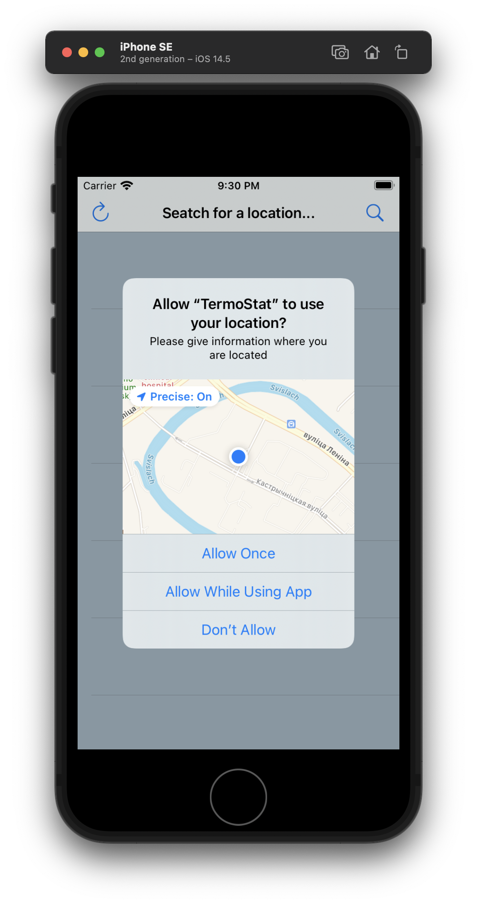

# TermoStat
## _Weather App_

TermoStat is a simple clone of the Weather app from Apple. It is my first project written in Swift.

## Technology Stack

- Networking
- JSON Parsing
- API
- Core Location
- UIKit(Programmatic UI)
- Apple account authorization

## Preview

